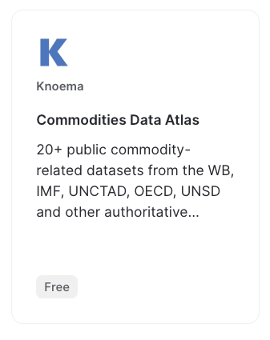
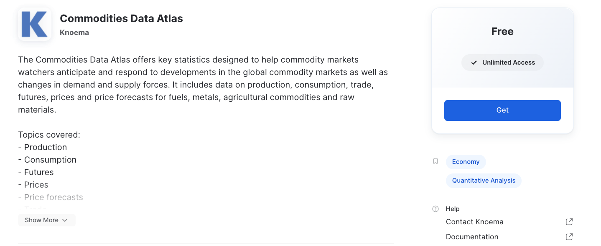
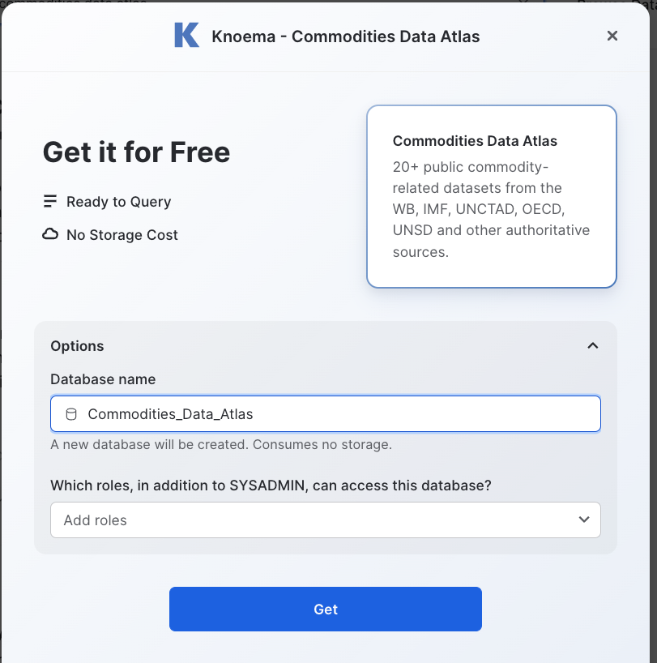

# Snowpark ML Demo

Uses US Corn Futures data from Knoema's [Commodoties Data Atlas](https://www.snowflake.com/datasets/knoema-commodities-data-atlas/) marketplace listing. We train a FB Prophet forecasting model using Snowpark Python Stored Procs (SPROCs) and deploy it using a User-Defined Table Functions (UDFs). A Streamlit app allows end users to re-run the model and explore the outputs. 

# Setup Steps
1. Get shared data from Marketplace:
1.1. In your Snowflake account, browse to the marketplace and search for Commodities Data Atlas.

1.2. Click "Get" button.

1.3. Accept terms, grant any additional roles access, and press OK.

2. Create view for Corn prices:
```
create or replace database commodities_forecasting;
use database commodities_forecasting;

create or replace view corn_price_daily as 
select 
    "Commodity" as commodity, 
    "Commodity Name" as commodity_name,
    "Symbol" as symbol,
    "Date" as date, 
    "Value" as value, 
    "Units" as units
from 
    "COMMODITIES_DATA_ATLAS"."COMMODITIES"."ICCOMEODR"
where 
    true 
    and "Commodity Name" = 'US Corn Futures'
    and "Frequency" = 'D'
    and "Units" = 'USD per 1 Bushel'
    and "Indicator Name" = 'Close';
    
```
3. Use notebook to train and deploy the model
3.1. Create `creds.json` file with your Snowflake account and credentials in the following format:
```
{
   "account": "YOURSNOWFLAKE-ACCOUNT",
   "user": "YOUR_USER",
   "role": "YOUR_ROLE",
   "password": "YOUR_PW",
   "database": "Commodities_Data_Atlas",
   "schema": "commodities",
   "warehouse": "YOUR_WH"
}
```
3.2. Walk through notebook. Run all cells to deploy `train_prophet` stored procedure, which deploys `predict` UDTF.
4. Run `streamlit run streamlit_app.py` to explore the streamlit app.